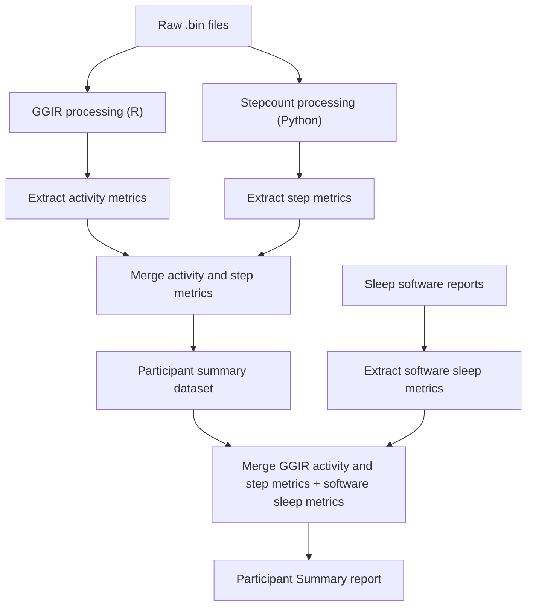

#  PCARRS GeneActiv Suite

**PCARRS GeneActiv Suite** is a comprehensive software ecosystem designed to process raw accelerometer data from GENEActiv devices. It automates the entire pipeline from signal processing (GGIR) and step count estimation (Python/Stepcount) to the generation of clinical PDF reports in multiple languages.

---

## 🌟 Key Features

* **End-to-End Automation**: From raw `.bin` files to final clinical reports.
* **Dual-Engine Processing**:
    * **R (GGIR)**: High-level activity and sleep metrics.
    * **Python (Stepcount)**: Machine-learning based step detection.
* **Batch Management**: Organize multiple studies/runs using a centralized batch system.
* **Multilingual Reporting**: Generates individual and combined reports in **English**, **Hindi**, and **Tamil**.
* **Portable Design**: Fully self-contained environment (R-Portable & Python-Portable) that runs without system-wide installations.

---

## 📂 Project Structure

```text
GENEActive_Suite/
├── app.R                   # Shiny UI and main orchestration logic
├── config.yml              # Centralized configuration (paths, thresholds)
├── code/                   # Core processing scripts (R & Python)
│   ├── run_GGIR.R          # Signal processing engine
│   ├── get_steps.py        # Python stepcount integration
│   ├── person_summary.R    # Data aggregation logic
│   └── generate_reports_*.R# Multilingual report engines
├── resources/              # Portable environments
│   ├── R_libs/             # Isolated R libraries
│   └── python_env/         # Isolated Python environment
├── data/                   # Input raw .bin files (organized by batch)
├── GGIR/                   # Intermediate GGIR outputs
├── summaries/              # Extracted CSV metrics
└── reports/                # Final PDF/Docx clinical reports
```

## Pipeline overview (diagram)



## 🛠️ Installation & Setup

The suite is designed to be **portable and self-configuring**. You can set it up using the pre-compiled executable or by cloning the repository.

### Option A: Using the Installer (Recommended)
1. **Run the Installer**: Execute `PCARRS_Suite.exe` to extract the application files.
2. **Apply Patches**: Navigate to the `patch/` folder and run `run_installer.bat`. 
   * This script automates the environment setup, verifies local paths, and ensures all portable dependencies are correctly linked.

### Option B: Manual Setup (Developers)
1. **Clone the Repository**:
   ```bash
   git clone [https://github.com/jack-junior/PCARRS-desktop-web.git](https://github.com/jack-junior/PCARRS-desktop-web.git)
   ```  
---

## 🚀 How to Use

### 1. Launching the Application
Simply double-click on `run_app.bat` or use the VBS launcher `PCARRS_Suite.vbs` for a silent background start.

### 2. Running the Pipeline

1.  **Select Raw Folder**: Point to the folder containing your `.bin` files.
2.  **Run Pipeline**:
    * **Step 1**: GGIR analysis.
    * **Step 2**: Python Step detection.
    * **Step 3 & 4**: Integration and merging of metrics.
    * **Step 5**: Final summary generation.

### 3. Report Generation
Navigate to the **Reporting** tab, select the participants, choose the language (**English**, **Hindi**, or **Tamil**), and click **Generate**. You can also merge all individual reports into a single study file.

---

## ⚙️ Configuration

All major settings are located in `config.yml`. You can adjust:

* **Paths**: Where data, summaries, and reports are stored.
* **GGIR Parameters**: Thresholds for MVPA, Sleep, and Inactivity.
* **Stepcount Settings**: Model type and sample rate.

---

## 🛠️ Troubleshooting

> [!IMPORTANT]
> **Note on Python**:
> The suite uses a dynamic detection logic. If the pipeline fails at "Activity Metrics", ensure your portable Python is located in `resources/python_env/python.exe`.

* **Missing UUID Package**: If `officer` fails during report generation, run:
    `install.packages("uuid", lib="resources/R_libs")`
* **GGIR Errors**: Ensure your `.bin` files are not corrupted and the path names do not contain special characters.

---

## 👥 Authors
* **GAYI Komi Selassi**
* **ASSOGBA Ayao Sangenis**

* **Tech Stack**: R (Shiny, GGIR, tidyverse), Python (Stepcount, PyTorch), Git.

---

## 📄 License
*Internal use only for PCARRS clinical study.*


